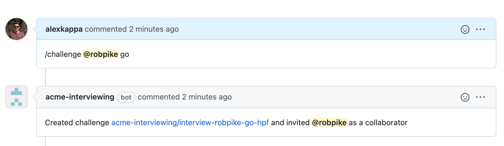
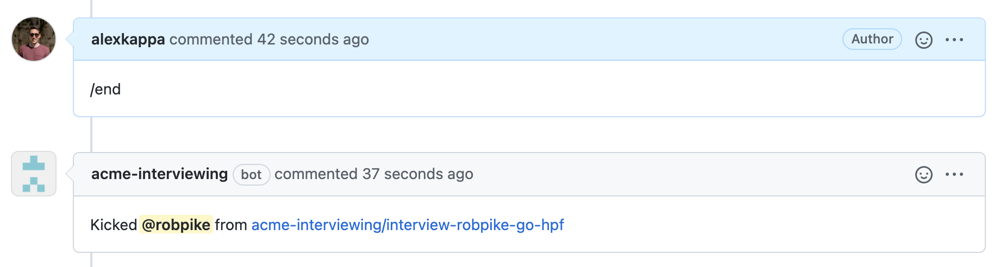
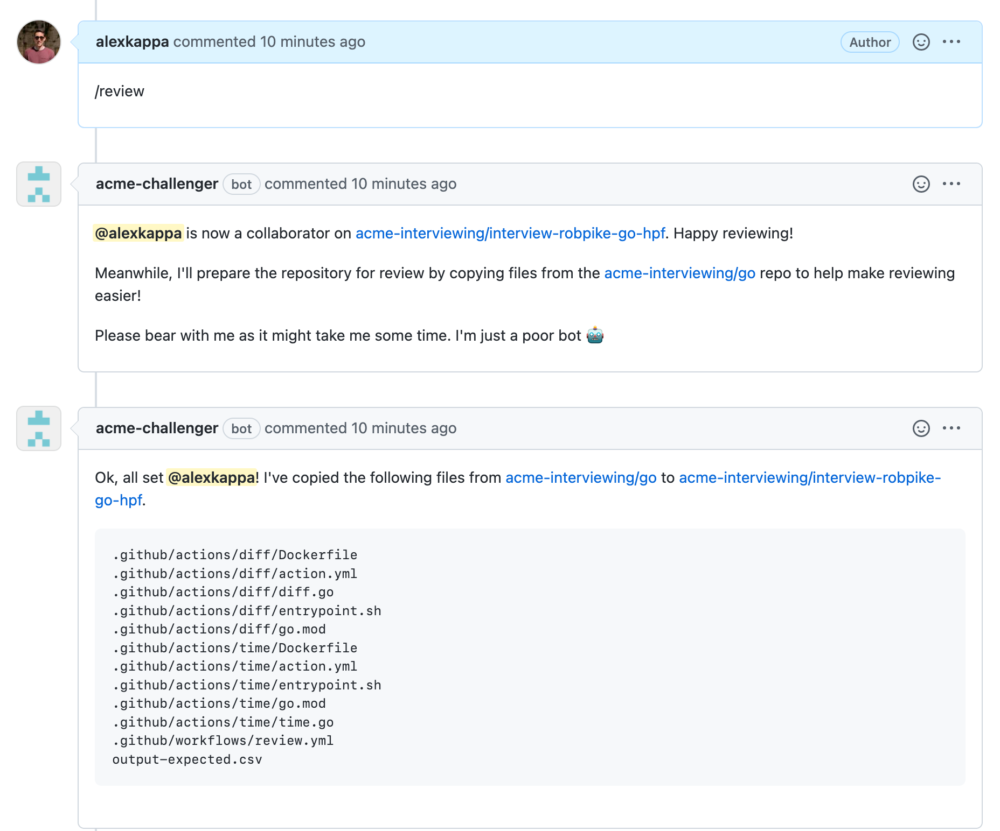
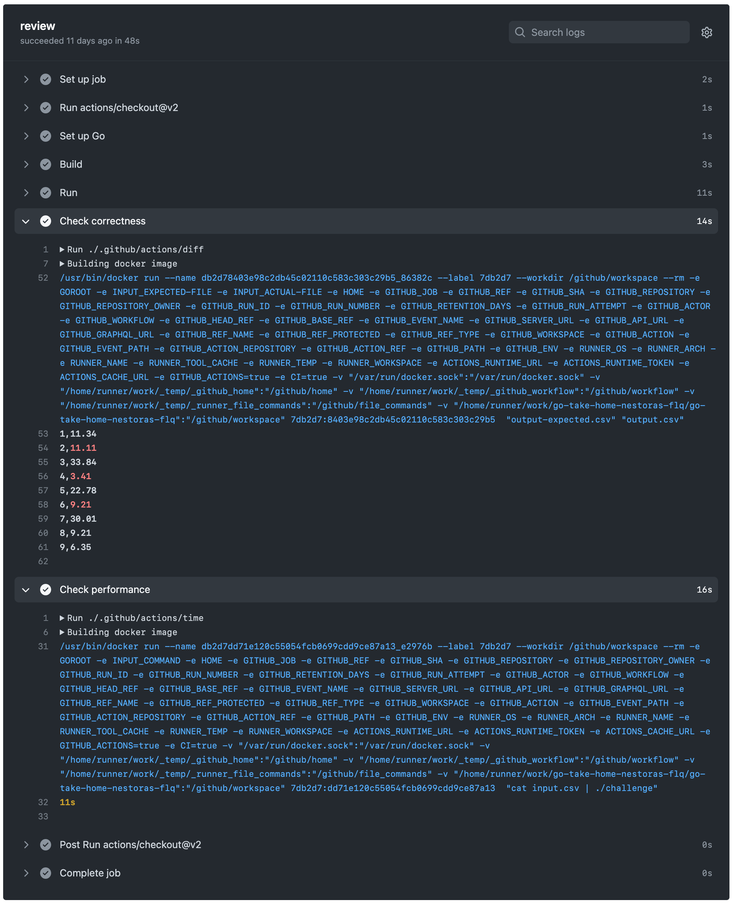

# acme-interviewing[bot]

This is a proof of concept exploring the automation of interviewing workflows.
It is intended to improve the time taken by reviewers to grade take-home
assignments, and make it easier on candidates when submitting them.

## Setup

```sh
npm install
npm start
```

## Docker

```sh
docker build -t bot .
docker run -e APP_ID=<app-id> -e PRIVATE_KEY=<pem-value> bot
```

## Usage

The bot listens for slash commands posted on issues or pull requests in
repositories of the [acme-interviewing](https://github.com/acme-interviewing)
organization.

As an example, lets prepare the coding challenge for
[@robpike](https://github.com/robpike). He aced the recruiter screen but now its
time to show us if he can handle our take-home assignment.

### Challenge a Candidate

To kick off the process, [create an
issue](https://github.com/acme-interviewing/interview/issues/new). The title
wont't matter for now, but in the body we'll use the `/challenge` slash command.

Where `<candidate>` is the GitHub username of the candidate and `<assignment>`
should match a repository under the
[acme-interviewing](https://github.com/acme-interviewing) organization. This
repository **must** be a template repository.



At this point the candidate should have received an invitation to collaborate on
the newly created repository.

### Ending the Challenge

Once the candidate is given sufficient time to complete the assignment, we can 
end the assignment by revoking their access to the repository.



The candidate no longer has access to the challenge and is therefore unable to 
commit any new changes.

### Reviewing the Code

To assist reviewers in evaluating the assignment, the `/review` command comes in
handy. It can copy files from the assignment template repository to the 
candidates repository. These files may enable automation in the form of GitHub 
Actions, or verification scripts.



In the example pictured above, several files were committed to the candidates
assignment. For the
[`go`](https://github.com/acme-interviewing/go-take-home/tree/review) challenge,
this includes the expected output, some automation workflows and scripts that
help verify the solutions correctness and timing.

Let's head over to the actions tab and inspect the output of these checks.



From these checks we can see that the candidates submission had three mistakes
in the resulting output as highlighted in red by the diff tool. Additionally the
process took 11s to complete, which may be a little on the slow side.

### Where next?

This project is in active development. Therefore new commands may be added, or
existing commands may be modified. For a full list of the supported
functionality is found by invoking the `/help` command.