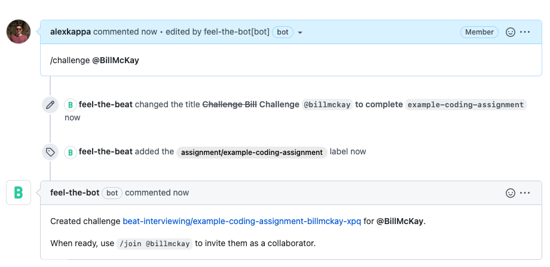
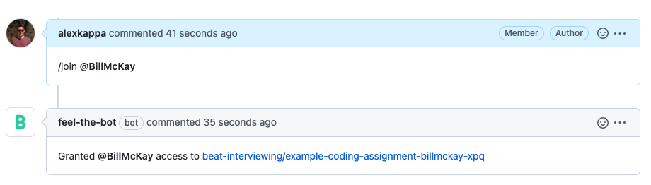
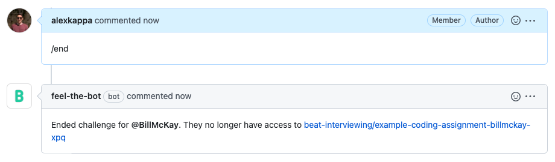
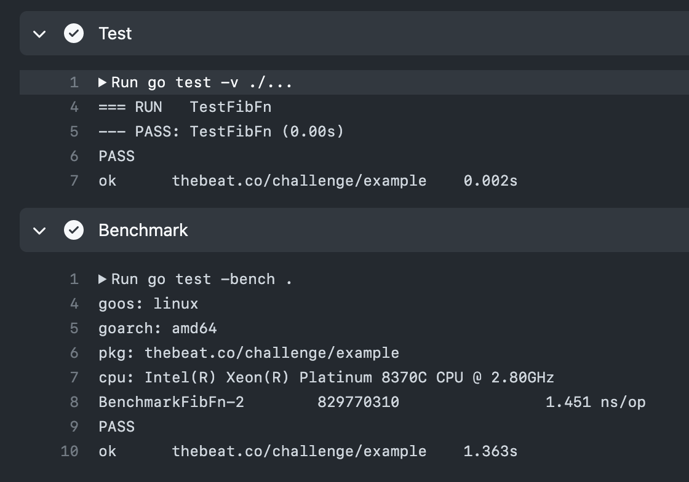
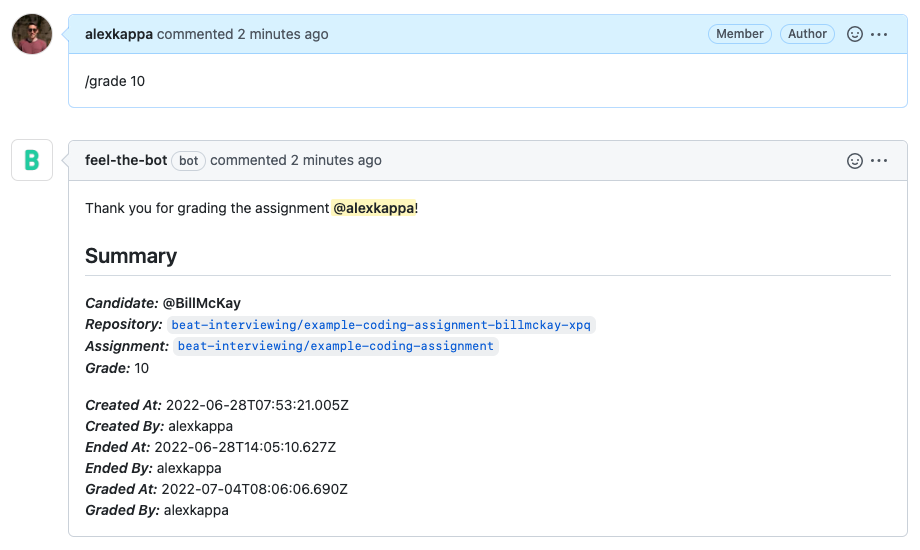

# Coding Assignment

A coding assessment is a short technical interview that is typically carried out
live, where the candidate is accompanied by an interviewer and is asked to solve 
a coding challenge.

Throughout this guide we'll use
[beat-interviewing/example-coding-assignment](https://github.com/beat-interviewing/example-coding-assignment)
as the coding assignment. The assignment requires candidates to implement a 
function which when called returns the next number in the Fibonacci sequence. In 
practice we encourage assignments that test on-the-job knowledge.

## Creating the challenge

From the [new
issue](https://github.com/beat-interviewing/example-coding-assignment/issues/new)
page we'll invoke the [`/challenge`](../challenge.md) command, using the GitHub
username of our candidate.

Shortly after the issue was created, Bot has done the following:

1. Cloned the assignment creating a new repo unique to the candidate
2. Updated the issue title
3. Assigned the `assignment/example-coding-assignment` label to the issue



## Inviting the candidate

When we are ready to begin, we can grant the candidate access to the repository
using the [`/join`](../join.md) command.

The candidate will receive an email inviting them to the repository. Once they
accept the invitation, they will have collaborator access to the repository.



## Conducting the interview

With the candidate having access to the repository, we're ready to conduct the
interview. This would typically involve a video call, where the candidate works
on their assignment with the support and guidance of an interviewer.

The candidate may use their own environment and their editor of choice, an
in-browser IDE such as [Repl.it](https://replit.com/),
[CodePen](https://codepen.io/), [JSFiddle](https://jsfiddle.net/) or [GitHub
Codespaces](https://github.com/features/codespaces)

Our example assignment makes use of [VSCode Remote
Containers](https://github.com/beat-interviewing/example-coding-assignment/tree/main/.devcontainer)
to provide the tools/runtime stack and its prerequisites in a Docker container.
Read more on development containers
[here](https://code.visualstudio.com/docs/remote/containers).

When the time allocated for the interview has elapsed, you may revoke the
candidates access to the repository using the [`/end`](../end.md) command.



## Reviewing the submission

Once the interview has concluded, the interviewer can review and grade the
candidates submission.

To assist in reviewing the submission invoke the [`/review`](../review.md)
command. This will grant the reviewer access to the repository and (if
configured accordingly) copy files from the assessment to help with the review.

These files may range from additional tests, benchmarks, or even GitHub actions.


Our coding example, copied a file named `bench_test.go` which benchmarks the
candidates implementation of `FibFn()`. Since the example has a GitHub Actions 
Workflow which triggers on each `push`, a new run is triggered.

<details>
  <summary>GitHub Workflow Run</summary>
    
</details>

⚠️ This action requires configuration. To configure which files are copied and
from where, the assignments
[.github/assignment.yml](https://github.com/beat-interviewing/example-coding-assignment/blob/main/.github/assignment.yml)
is defined as follows:

```yml
challenge:

review:
  copy:
    # Branch name from which to copy files. This will be from the assignments 
    # repository. 
    # 
    # E.g. beat-interviewing/example-coding-assignment
    head: 'review'
    
    # Branch name to which to copy files. This will be from the candidates own 
    # repository. 
    # 
    # E.g. beat-interviewing/example-coding-assignment-billmckay-xpq
    base: 'main'
    
    # Glob pattern with which files are matched. Anything matching this pattern 
    # will be copied from the assignment repository to the candidates repository
    # 
    # See: https://github.com/isaacs/minimatch
    paths:
    - 'bench_test.go'
```

For a full reference of the `.github/assignment.yml` options, see
[configuration](../configuration.md).

## Grading

With the review material in place, reviewers are able to finally grade the 
assignment. Grading assigns metadata to the assignment relating to the 
candidates performance.

The [`/grade`](../grade.md) command is particularly useful when integrated with
a third-party recruitment tool such as Greenhouse. 


